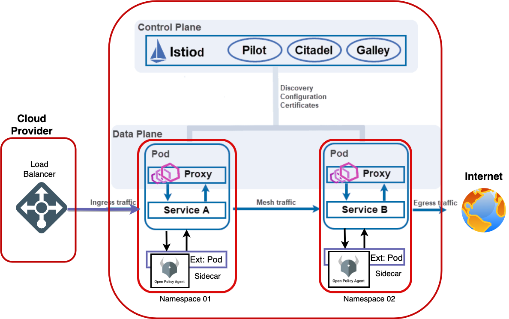

### Prerequisites (Your own machine)
This playground uses the following technology so you will need to check they are installed:

-   VS Code
-   opa Extension for VSCode
-   Terminal (We use Bash)
-   Rego Playground
-   Some knowledge of basic service mesh and ingress traffic
-   Some knowledge of programming fundamenals

## Architecture
<p align="left">

</p>


# Introduction
### WHAT IS Rego
OPA's purpose-built, declarative language Rego. Rego includes rich support for traversing nested documents and transforming data using syntax inspired by dictionary and array access in languages like Python and JSONPath.
In this playground we are going to build a web application in python and Flask via the TDD process.
We will write tests to describe the functionality of the components.

# set up your environment

### Opening the Next.js application in VS Code

### Step 1
To get the environment prepared for the event you will need your meetup username.

You can find while logged in at [meetup.com](https://meetup.com) as in the example below

<p align="center">

</p>

Copy the username, in the above example it is `DevOps Playground`, and go to  [lab.devopsplayground.org](https://lab.devopsplayground.org/) and paste your username to the form like in the example below


<p align="center">

</p>

### Step 2
Copy the IDE link

Open a new tab and paste that link into the address bar of the new tab. 

You should be presented with VS Code which should look something like this:

### Step 3
Getting Started:
In your labs folder navigate to Lab01 and open the getting started file - [getting-started.md](./Labs/Lab01/getting-started.md)

This is a walkthrough of the basics of rego language: here we will review the types and rules of writing rego

### Step 4
#### Rego Language Basics
In your labs folder navigate to Lab01 and open the getting started file - [language-basic.md](./Labs/Lab01/language-basic.md)

### Step 5
OPEN the link to the rego playground
https://play.openpolicyagent.org/p/pcXnGFFBb0

### Step 6
Rules
Copy and paste the following section into your playground
```ocaml
allow_world if {
	"world" != "world"
}

allow_new_world if {
	"world" == "world"
}
```
### Step 7
Copy and paste the following section into your playground
Condition
```ocaml
greeting := true {
 data.greetings == "hello world"
 input.message == "worlds"
}
```
### Step 8
OPEN the link to the rego playground on a new tab on your browser
https://play.openpolicyagent.org/p/AyJQ4vOrHX

### Step 9
Demo Labs

In this lab will will be reviewing the policy we have already defined in our configmap

https://play.openpolicyagent.org/p/cFmhezkVGI

Run the following command on your workstation to inspect our configmap

```
kubectl get configmap opa-policy -o yaml
```
### Step 10

Lets deploy our application: Book-Info Application

Installing the book info Application
```bash
kubectl apply -f https://raw.githubusercontent.com/istio/istio/master/samples/bookinfo/platform/kube/bookinfo.yaml
```
Installing the book info Ingress
```bash
kubectl apply -f https://raw.githubusercontent.com/istio/istio/master/samples/bookinfo/networking/bookinfo-gateway.yaml
```
verify that your pods are running ok

```bash
kubectl get pods
```
### Step 11

Run the following coming to verify that your caan access the product package
```bash
kubectl exec "$(kubectl get pod -l app=ratings -o jsonpath='{.items[0].metadata.name}')" -c ratings -- curl -sS productpage:9080/productpage | grep -o "<title>.*</title>"
```
You should see the following output
```
<title>Simple Bookstore App</title>
```

## User Alice: Access Control - Guest
### Step 12

Test to confirm that user alice has product page access
```bash
kubectl exec "$(kubectl get pod -l app=ratings -o jsonpath='{.items[0].metadata.name}')" -c ratings -- curl -sS productpage:9080/productpage --user alice:password
```

### Step 13
Test to confirm that user alice has API endpoint access
```bash
kubectl exec "$(kubectl get pod -l app=ratings -o jsonpath='{.items[0].metadata.name}')" -c ratings -- curl -sS productpage:9080/api/v1/products --user alice:password
```

## User Bob: Access Control - Admin
### Step 14
Repeat same steps for user bob who is an admin
```bash
kubectl exec "$(kubectl get pod -l app=ratings -o jsonpath='{.items[0].metadata.name}')" -c ratings -- curl -sS productpage:9080/productpage --user bob:password
```
### Step 15
```bash
 kubectl exec "$(kubectl get pod -l app=ratings -o jsonpath='{.items[0].metadata.name}')" -c ratings -- curl -sS productpage:9080/api/v1/products --user bob:password
```

# OPA Integration
## Edit AuthorizationPolicy
### Step 16

Get the current authorizationpolicy
```bash
kubectl get authorizationpolicy
```
Edit the authorizationpolicy and change the label to app: productpage
```bash
kubectl edit authorizationpolicy
```
- press escape on your key board

- and type wq! to save changes

```bash
kubectl get authorizationpolicy
```

### Step 17

## Repeat Steps 12 -15


### Step 18

Checking the logs
```bash
kubectl logs opa-6fd9dbb96-89gm8|grep decision
```
