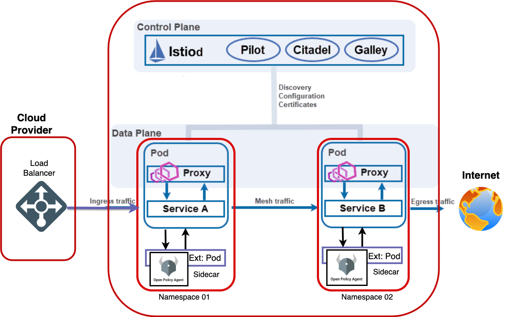
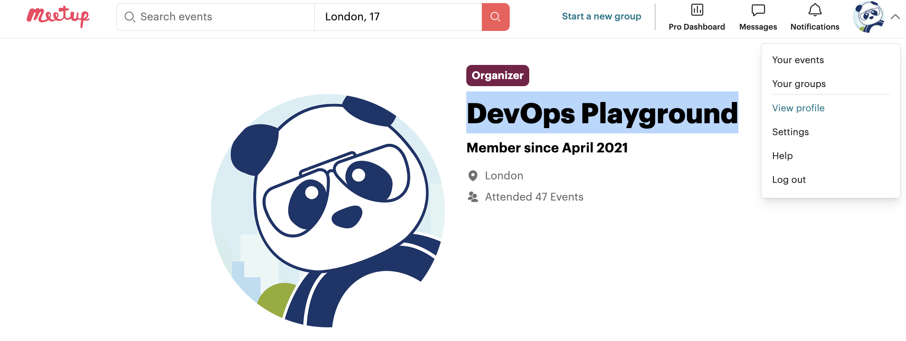
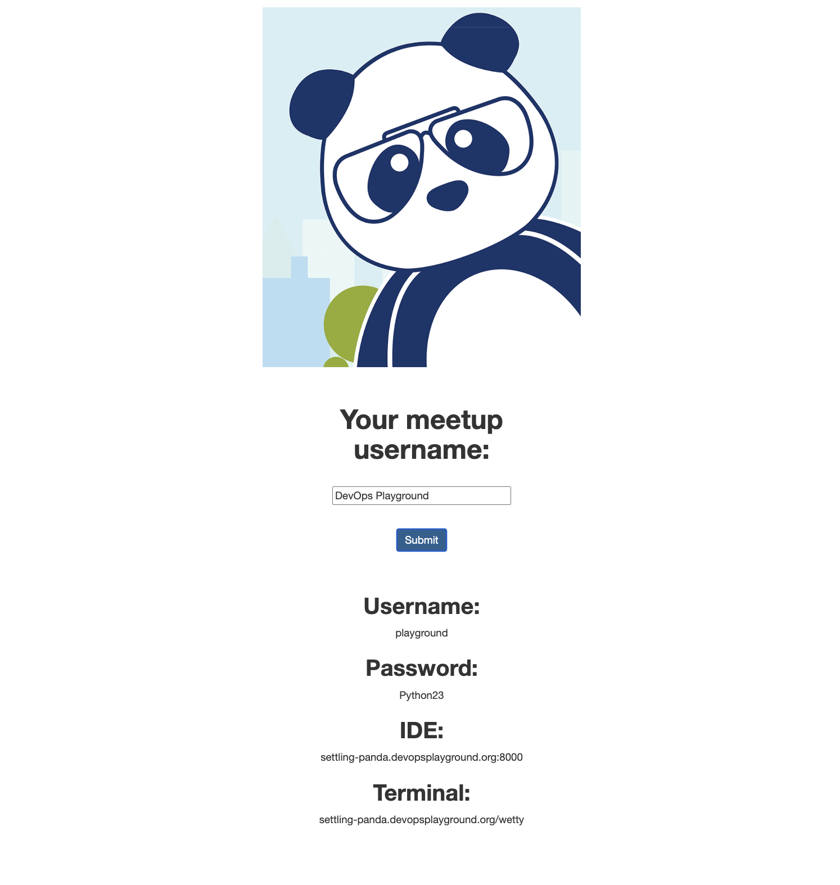

### Prerequisites (Your own machine)
This playground uses the following technology so you will need to check they are installed:

-   VS Code
-   opa Extension for VSCode
-   Terminal (We use Bash)
-   Rego Playground
-   Some knowledge of basic service mesh and ingress traffic
-   Some knowledge of programming fundamenals

## Architecture

# Introduction
### WHAT IS Rego
OPA's purpose-built, declarative language Rego. Rego includes rich support for traversing nested documents and transforming data using syntax inspired by dictionary and array access in languages like Python and JSONPath.
In this playground we are going to build a web application in python and Flask via the TDD process.
We will write tests to describe the functionality of the components.

# set up your environment

### Opening the Next.js application in VS Code

### Step 1
To get the environment prepared for the event you will need your meetup username.

You can find while logged in at [meetup.com](https://meetup.com) as in the example below

Copy the username, in the above example it is `DevOps Playground`, and go to  [lab.devopsplayground.org](https://lab.devopsplayground.org/) and paste your username to the form like in the example below

### Step 2
Copy the IDE link

Open a new tab and paste that link into the address bar of the new tab. 

You should be presented with VS Code which should look something like this:

### Step 3
Getting Started:
In your labs folder navigate to Lab01 and open the getting started file -   getting-started.md  
/Labs/Lab01/getting-started.md

This is a walkthrough of the basics of rego language: here we will review the types and rules of writing rego

### Step 4
#### Rego Language Basics
In your labs folder navigate to Lab01 and open the getting started file -   language-basic.md  
/Labs/Lab01/language-basic.md 

### Step 5
OPEN the link to the rego playground
https://play.openpolicyagent.org/p/uhfkfkTwmy

